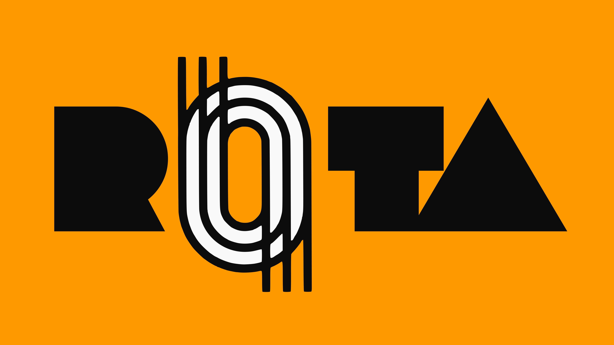

# ROTA 

 

Bem-vindo à organização oficial da **ROTA** no GitHub. Este ecossistema de software foi desenvolvido como objeto de estudo e implementação para um Trabalho de Conclusão de Curso (TCC), com foco em soluções tecnológicas aplicadas à área da **saúde**.

## 📋 Sobre o Projeto

A ROTA é uma plataforma dedicada a otimizar processos no setor de saúde, integrando tecnologias de ponta para garantir performance, escalabilidade e segurança de dados. O projeto está estruturado em uma arquitetura de microsserviços e bibliotecas compartilhadas para garantir a consistência de tipos e lógica de negócio.

## 🛠️ Stack Tecnológica

Utilizamos tecnologias modernas e robustas para suportar as demandas do ecossistema:

- **Frontend:** React Native e React (Mobile e Website)
- **Backend:** NestJS & Express (Node.js)
- **Linguagem:** TypeScript
- **Banco de Dados:** PostgreSQL (Relacional)
- **Cache & Performance:** Redis
- **Tipagem:** Biblioteca interna de Types customizada

---

## 📂 Organização do Ecossistema

Nossa arquitetura está dividida em três pilares principais para facilitar a manutenção e o desenvolvimento isolado:

### 1. [rota-backend](https://github.com/ROTA-TCC/rota-backend.git)
Núcleo de inteligência e API do sistema. Desenvolvido com **NestJS** e **Express**, gerencia a lógica de negócio, autenticação e integração com os bancos de dados PostgreSQL e Redis.

### 2. [rota-frontend](https://github.com/ROTA-TCC/rota-frontend.git)
Interface mobile desenvolvida em **React Native**. Focada na experiência do usuário (UX) e acessibilidade dentro do contexto hospitalar/clínico.

### 3. [types](https://github.com/ROTA-TCC/types.git)
Nossa biblioteca interna de tipagem. Centraliza todas as interfaces e definições **TypeScript**, garantindo que tanto o frontend quanto o backend falem a mesma "língua" e evitem erros de contrato.

---

## 👥 Equipe de Desenvolvimento

Este projeto é desenvolvido exclusivamente pelos membros do grupo de TCC:

- **Gustavo Magalhães** - [GitHub](https://github.com/Gustavo-777-Magalhaes
)
- **Miguel Martins Menzel** - [GitHub](https://github.com/MiguelMartinsMenzel)
- **Thiago Silva** - [GitHub](https://github.com/Thiago-Sillva)
- **Rafael Martins Paiva** - [GitHub](https://github.com/Rafael-Martins-Paiva)
- **Cezar** - [GitHub](https://github.com/)
---

## 🚀 Status do Projeto

Atualmente, o projeto encontra-se em fase de desenvolvimento ativo para finalização do ciclo acadêmico. Por ser um projeto de TCC, **não estamos aceitando contribuições externas** no momento.

---

  Desenvolvido com foco em inovação e tecnologia para a saúde.

